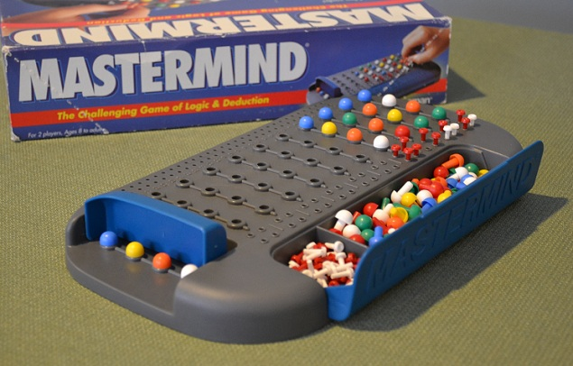

# MASTERMIND 

Las reglas básicas del Mastermind son las siguientes:
+ El jugador 1 elige una combinacion de N colores (dependiendo del tipo de juego) que tendra que ser descifrada por el jugador 2.
+ El jugador 2, mediante clavijas de distintos colores, tendra que ir proponiendo distintas combinacione con un maximo de 10 intentos.
+ El jugador 1 evaluara la combinacion propuesta por el jugador 2 y le informara de:
    + Que colores existen en la combinacion pero se encuentran en otra posicion, los cuales se marcaran con clavijas de color blanco.
    + Que colores se encuentran en la posicion correcta, los cuales se marcaran con clavijas de color negro.
+ Cuando el jugador 2 consiga 4 clavijas negras antes de que se acaben los 10 intentos, habra descifrado el codigo del jugador 1.

Aqui se especifican mas detalladamente sus reglas -> [Mastermind](https://es.qaz.wiki/wiki/Mastermind_(board_game))

## Modelo del dominio de Mastermind

 
 
### Diagrama de clases de Mastermind
 
 
 
